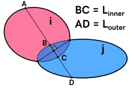
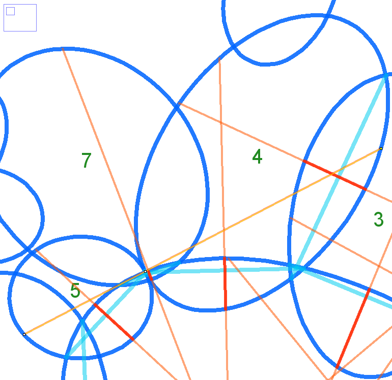
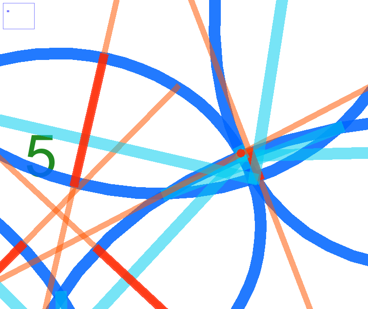

# Issues

## 1. Near-Zero Overlaps

When two ellipses overlap, points (B & C) on the inner edges (determined by the point where the line perpendicular to the compromise boundary line midpoint intersects the nearest edge of each ellipse) are separated by a distance, *L_inner*. 

If *L_inner = 0*, then the ellipses would be tangential, hence there would be no compromise boundary. Thus, *L_inner > 0* is expected. However, when the overlap is so small that *L_inner < 0.5px*, ImageJ fails to draw the line between the points (B & C). 

The line, ABCD, has B and C at the same point:

    x: 517.7108, 286.1544, 286.1393, 167.0288
    y: 300.4991, 421.1459, 421.1538, 483.2134

As such, the line BC cannot be drawn by ImageJ. Instead this is noted by a dot, as shown:

The issue has been resolved and did not affect the calculations; ImageJ would encounter an error due to the attempt to draw a non-existent selection. 

To illustrate the issue a minimal working example (MWE) ImageJ macro is included to show that the line cannot be drawn. 

* **near_zero_overlap_MWE.ijm** : This macro does not require any data or user inputs. Simply run it. 